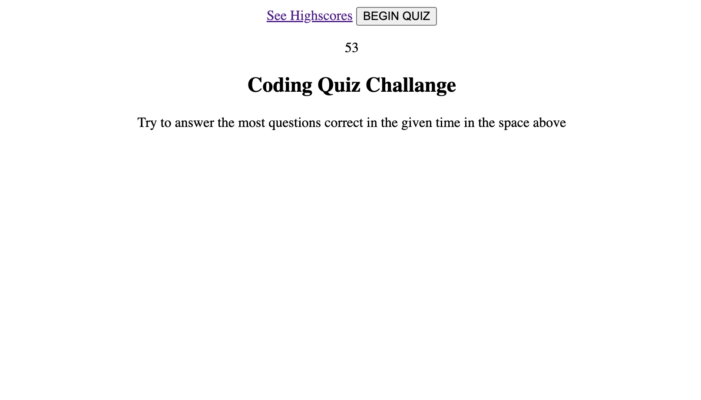

MODULE 4 CHALLANGE "CODING QUIZ"

USER STORY
     AS A coding boot camp student
    I WANT to take a timed quiz on JavaScript fundamentals that stores high scores
    SO THAT I can gauge my progress compared to my peers

ACCEPTANCE CRITERIA
     GIVEN I am taking a code quiz
    WHEN I click the start button
    THEN a timer starts and I am presented with a question
    WHEN I answer a question
    THEN I am presented with another question
    WHEN I answer a question incorrectly
    THEN time is subtracted from the clock
    WHEN all questions are answered or the timer reaches 0
    THEN the game is over
    WHEN the game is over
    THEN I can save my initials and score

SCREENSHOT OF FINISHED PRODUCT

PURPOSE OF THE WEBSITE
    The purpose of this website is to have a set of questions thst I can answer myself thruought the remainder of the course to test how much i've grown in coding knowldege 
